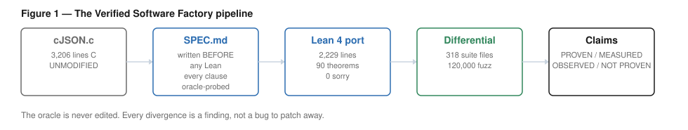
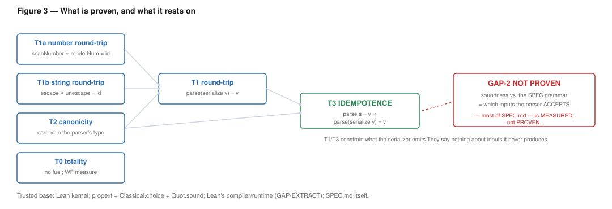
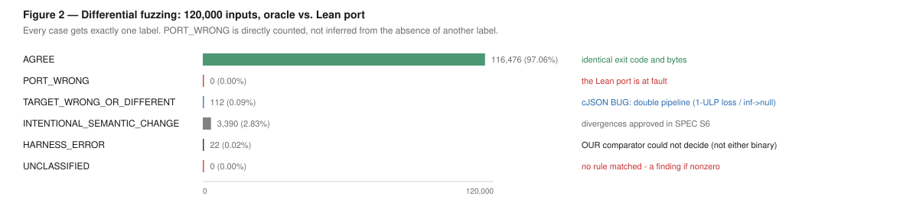

# Where AI-Assisted Formalization Breaks: A Verified Software Factory Case Study on cJSON

**Artifact v1.0** · Lean 4.32.0 · oracle: cJSON `fb16e5c` (unmodified)
All claims reproducible with `./verify.sh`. Claim taxonomy in `CLAIMS.md`.

---

## Abstract

We ran a controlled experiment: take a real, widely-deployed C library (cJSON, ~3,200 lines),
have an AI agent translate its core parse/serialize path into Lean 4 with machine-checked
proofs, and *instrument the process itself* to find where it breaks. The C source is the
oracle and is never edited; every behavioural difference is recorded as a finding rather than
patched away.

The port is 2,240 lines of Lean, 90 theorems, zero `sorry`, zero project axioms, no Mathlib. <!-- claim:lean_lines=2240 --><!-- claim:theorem_count=90 -->
We prove totality (with no fuel parameter), a round-trip theorem, a canonicity invariant, and
— unconditionally — that anything the parser produces re-parses to itself. Differential
testing over JSONTestSuite (318 files) and 120,000 fuzzed inputs measured **PORT_WRONG = 0** — <!-- claim:suite_files=318 --><!-- claim:fuzz_n=120000 --><!-- claim:fuzz_port_wrong=0 -->
zero cases where the Lean port is wrong — and **four genuine bugs in cJSON**, including one that
silently changes a JSON value's *type* and one that accepts syntactically invalid input as valid.

Three findings are of general interest.

**(1) The property we were asked to prove was false of the target.** cJSON's round-trip is
lossy *by its own evident intent*: its "can I recover this double?" check uses a ~1-ULP
tolerance, so it emits numbers it did not parse. We discovered this in the specification
phase, before writing any Lean. Had we discovered it in the proof phase, the natural response
— weaken the theorem until it passes — would have produced a technically-correct artifact
that certified nothing.

**(2) Nothing broke in the mathematics.** Every genuine proof obligation went through once
stated correctly. What broke was, in order of cost: our own *measurement instruments* (three
times), and the interaction between Lean's dependent types and its tactic ergonomics. We
document seven specific ergonomic failures, several of which produced error messages pointing
nowhere near the cause.

**(3) The honest scope of what we proved is much narrower than "we verified a JSON parser."**
We prove things about what the serializer emits. We prove *nothing* about which inputs the
parser accepts — and the accept-set is most of what our own specification actually says. We
state this as a first-class result rather than a footnote, because we believe the gap between
"has theorems" and "is verified" is the central risk in AI-assisted formalization.

---

## 1. The experiment

**Question.** How far can an AI agent translate a real C library into Lean while preserving
semantics, and where does the process actually break?

**Design.** Five phases, with hard rules chosen to make failure *visible* rather than
absorbable:

1. **Oracle preserved.** The C source is vendored byte-for-byte (sha256-checked in
   `verify.sh`) and never modified. A 62-line wrapper gives it a CLI contract.
2. **Specification before implementation.** `SPEC.md` is written first, and every clause is
   verified by *probing the compiled oracle*, not by reading the C.
3. **Executable port.** A Lean binary with an identical CLI contract, so the two are drop-in
   comparable.
4. **Differential testing.** JSONTestSuite + 120k fuzz, both binaries, exact byte comparison.
   Every divergence is classified: *(a) port wrong, (b) original has a bug, (c) spec ambiguity,
   (d) deliberate change.*
5. **Proofs, and an honest ledger.** No theorem may be weakened without logging the before/after.
   No `sorry`, no `native_decide`, no custom axioms, no Mathlib.

The rule that mattered most: **a divergence is a finding, not a bug to patch away.** It is what
turned the C's bugs into results instead of noise.



---

## 2. The crux: the theorem was false of the target

We were asked to prove, in Phase 4, that `parse (serialize v) = v`.

Reading `print_number` in the specification phase, we found:

```c
static cJSON_bool compare_double(double a, double b) {
    double maxVal = fabs(a) > fabs(b) ? fabs(a) : fabs(b);
    return (fabs(a - b) <= maxVal * DBL_EPSILON);   /* ~1 ULP relative tolerance */
}
```

cJSON prints a number with `%1.15g`, re-reads it, and falls back to 17 digits only if the
re-read value "differs" — where "differs" is that tolerance, **not equality**. The consequence,
verified against the compiled binary:

| input | cJSON output | same IEEE double? |
|---|---|---|
| `0.30000000000000004` | `0.3` | **no** |
| `1.0000000000000002` | `1` | **no** |
| `9007199254740993` | `9.00719925474099e+15` | **no** |

**`print(parse(x))` is not value-preserving in cJSON.** The round-trip theorem is *false of the
target*. This is not a proof difficulty; it is a property the artifact lacks. Combined with two
neighbours — `1e400` parses and then prints as `null` (a number silently changes its JSON
**type**), and `-0` normalises to `0` — cJSON's number pipeline is not something one can
formalize as correct.

### Why the timing is the finding

Imagine encountering this in Phase 4 instead. The proof of `parse (serialize v) = v` fails.
The locally-rational response — and, we suspect, the *likely* response of an agent optimizing
for "make the build green" — is to weaken the theorem until it passes: restrict to "small"
numbers, or add a `Float`-approximation hypothesis, or quietly prove round-trip up to a
tolerance. Each of those produces a theorem that compiles, a green build, and an artifact that
certifies nothing about the property anyone cared about.

The hard rule *"never weaken a theorem without logging the before/after"* is designed to catch
exactly this. But it only helps if you notice you are doing it. The stronger protection was
structural: **write the spec first, and verify it against the oracle before writing a line of
implementation.** That forced the discovery into a phase where the only available response was
to stop and ask a human what the artifact should even be.

The decision taken (recorded in `SPEC.md` §S6): model JSON numbers **exactly** (`± digits ×
10^exp`, canonical), not as IEEE doubles. Then the round-trip theorem is *true* and provable,
and every number-related divergence from the oracle becomes a **measurement** of how far the
real C is from anything provable — rather than being hidden inside a hand-rolled `strtod` that
would have been the single most likely source of a silent bug in the whole artifact.

---

## 3. What we proved

Four theorems, all kernel-checked; `lake build` fails if any breaks.

**T0 — Totality (no fuel).** We expected to need a fuel parameter and to have to declare a
fuel bound. Instead: make every parser return a *subtype carrying the proof that it consumed
at least one byte*. The decrease is then in scope at each recursive call site, and Lean's
termination checker accepts the mutual block on the lexicographic measure
`(remaining bytes, 0 for parseValue / 1 for the loops)`.

There is **no fuel to exhaust and no bound to declare.** The 1000-deep nesting limit is a
*semantic* limit from the spec, not a termination device.

**T1 — Round-trip.** `Canonical v → jdepth v ≤ 1000 → parseDoc (serialize v) = some v`.

Both hypotheses are real. `jdepth v ≤ 1000` is **not removable**: a deeper value serializes
fine but does not re-parse, because the parser enforces cJSON's limit. We state it rather than
hide it.

The theorem is a genuine *normalisation* statement, not a tautology, because the AST stores
numbers canonically: `100`, `1e2` and `1.0e2` all parse to the **same node**, which must print
back to one canonical spelling. (Choosing the mantissa as a canonical *digit list* rather than
a `Nat` was the design decision that made this tractable — it eliminated an entire
`Nat ↔ digits` inverse proof that would otherwise have been the largest hidden cost.)

The number sub-lemma needs a precondition that is **load-bearing, not cosmetic**: the theorem
is false for an arbitrary tail. `renderNum 1 = "1"`, and `scanNumber("1" ++ "2") = 12`. A JSON
number has no terminator, so it can only be recovered when the next byte cannot continue the
token — which is exactly what holds at every site the serializer actually emits a number
(`,`, `]`, `}`, or end of input).

**T2 — Canonicity, and how we closed it.** T1's `Canonical v` hypothesis is worthless unless
the parser always satisfies it. Our first attempt was a mutual induction over the
`parseValue.induct` principle Lean generates for the WF-recursive parser. That principle has
**26 minor premises**, each carrying dependent-subtype hypotheses. We abandoned it and shipped
the gap honestly in a prior revision.

The route that worked: **put the invariant in the return type**, the same device that bought
fuel-free totality.

```lean
abbrev Res (α : Type) (P : α → Prop) (s : List UInt8) : Type :=
  Option { p : α × List UInt8 // p.2.length < s.length ∧ P p.1 }

def parseValue (depth : Nat) (s : List UInt8) :
    Res JSON (fun v => JSON.Canonical v ∧ jdepth v ≤ nestingLimit - depth) s
```

The obligation is now discharged at ~8 construction sites, and `parseDoc_canonical` /
`parseDoc_depth` are *projections*. Both properties are `Prop`s and erased at runtime — we
re-ran the full differential suite and the emitted bytes are **identical**, before and after.

**Method claim, offered for reuse:** for a recursive-descent parser defined by well-founded
recursion, strengthening the return type is dramatically cheaper than the generated induction
principle. The first route consumed hours and was abandoned; the second took about one.

**T3 — Idempotence (unconditional).** `parseDoc s = some v → parseDoc (serialize v) = some v`.

Anything this parser produces re-parses to itself. T1's two hypotheses are *discharged* by T2,
not assumed. This is the theorem a user actually wants.



---

## 4. What we measured



**JSONTestSuite (318 files):** 297/318 byte-identical, 317/318 identical accept/reject. <!-- claim:suite_byte_agree=297 --><!-- claim:suite_accept_agree=317 -->

| binary | `y_` accept | `n_` reject |
|---|---|---|
| cJSON | 95/95 | 155/188 <!-- claim:suite_oracle_y_accept=95 --><!-- claim:suite_oracle_n_reject=155 --> |
| Lean port | 95/95 <!-- claim:suite_lean_y_accept=95 --> | **156/188** <!-- claim:suite_lean_n_reject=156 --> |

The Lean port rejects one *more* invalid input than cJSON. The 32 shared `n_` failures are
cJSON's deliberate laxity (trailing garbage, lax numbers, control characters in strings),
which the port replicates on purpose.

**Fuzzing (120,000 inputs, seed 20,260,714):** 116,476 exact agreements (97.06%). <!-- claim:fuzz_n=120000 --><!-- claim:fuzz_seed=20260714 --><!-- claim:fuzz_agree=116476 --><!-- claim:fuzz_agree_pct=97.06 -->
**`PORT_WRONG` = 0**, directly counted; **`UNCLASSIFIED` = 0**. <!-- claim:fuzz_port_wrong=0 --><!-- claim:fuzz_unclassified=0 -->

**Four genuine cJSON bugs**, all reproducible from `DIVERGENCES.md`:

| bug | effect |
|---|---|
| `1e400` → `null` | a number silently changes its JSON **type** (`errno` from `strtod` never checked) |
| 1-ULP loss | `0.30000000000000004` → `0.3`, a *different* double (`compare_double`, §2) |
| `"\uZZZZ"` → `""` | **invalid input accepted as valid**: `parse_hex4` returns `0` for both `0000` and any invalid digit; the caller cannot distinguish |
| embedded NUL | `{"foo\0bar":42}` → `{"foo":42}`; content **silently discarded** |

The last two are the sharp ones. Two JSONTestSuite files (`y_string_null_escape`,
`y_object_escaped_null_in_key`) are cases cJSON *accepts but answers wrong*.

---

## 5. Where it actually broke

This is what the experiment was for. **Nothing broke in the mathematics.** Every genuine proof
obligation — number normalisation, the four printer branches, escape/unescape, the mutual
induction — went through once stated correctly. The failures were elsewhere.

### 5.1 The instruments broke first, three times

**(i)** Our first seven "findings" from reading `cJSON.c` included three that were **wrong**.
Two of them were wrong because **bash's `printf` was silently interpreting `\uXXXX`** in our
probe scripts, so we were feeding the oracle actual UTF-8 bytes instead of the literal
backslash-u text we thought we were sending. We caught it only because the results were
*surprising* enough to re-run with byte-exact Python.

**(ii)** The first 120k fuzz run reported 22 UNKNOWN divergences — the only category we
actually cared about. All 22 were a bug in our classifier: `json.loads(b"null")` legitimately
returns Python `None`, and we had used `None` as the "parse failed" sentinel.

**(iii)** The second run left exactly one UNKNOWN. That was *also* the classifier: Python's
`Decimal` caps exponents and raises on `1e400030000000000000004`. Both binaries had behaved
exactly as specified.

Chasing (iii) surfaced the only genuine finding **against our own port** (`D-LEAN-1`):
modelling numbers exactly means the serializer will faithfully emit an exponent of any
magnitude, producing output that is legal RFC 8259 but that most JSON consumers cannot
round-trip. Exactness has an interop cost. **We would not have found it without an instrument
that broke.**

The general lesson is uncomfortable and, we think, underrated: in an AI-driven verification
pipeline, *the harness is code too*, it is written with the same fluency and the same
overconfidence as the artifact, and it is **not** protected by a kernel. A green differential
test is only as trustworthy as the comparator, and ours was wrong three times.

### 5.2 Seven Lean ergonomic failures, with their true causes

| # | symptom | actual cause |
|---|---|---|
| 1 | every `omega` fails: *"No usable constraints found"* | `omega` **does not unfold reducible type abbreviations**. A one-line cosmetic `abbrev Digit := Nat` silently disabled the main arithmetic tactic across the whole development. The error message says nothing about type aliases. |
| 2 | `abbrev Bytes := List UInt8` fails to unify with `List UInt8` — but only inside a `mutual` block | never diagnosed; worked around. Identical code compiled standalone. |
| 3 | `ring`, `push_cast`, `set`, `interval_cases` all missing | they are **Mathlib**, not core. Forbidden by the rules. The forced workaround (fold one digit at a time, avoiding `10^n` entirely) produced a *better* proof than the version needing `ring`. |
| 4 | *"motive is not type correct"*, five times | the subtype that buys fuel-free totality makes `parseValue d s : Res JSON s` — the **return type depends on the argument**. Any rewrite of the argument inside the parser's match fails. Fix: keep the rewritten term **in the lemma's statement** and push the rewrite out to the caller, where it is an ordinary hypothesis rewrite. |
| 5 | `induction ... with \| nil => ...` rejected as ambiguous | `JSON.rec` emits **two alternatives named `nil` and two named `cons`**, because the nested inductive contains both `List JSON` and `List (Bytes × JSON)`. Positional `refine ?_ ?_ ...` was the only way through. |
| 6 | ~10 *"unknown identifier `skipWs`"* errors that read like type errors | we had appended a block **after `end Cjson`**, so the entire parser core silently landed outside its namespace. Several iterations were spent hunting in the wrong place. |
| 7 | `split` on a variable-headed match vs. eight literal patterns is a fight | the clean move was to prove the head byte is one of **eleven concrete literals** and `rcases` on them, so the match reduces definitionally. Making the head literal was worth more than any tactic. |

Failures 1, 2, and 6 share a property worth naming: **the error message pointed nowhere near
the cause.** An agent that trusts error messages as a search signal will burn a lot of budget
there. The reliable technique — used to isolate (1) and (2) — was to reduce to a two-line
standalone file and see whether the behaviour persisted.

### 5.3 What this suggests about AI-assisted formalization

The naive worry is that the agent will fail at the hard mathematics. It did not. The
mathematics was the *easy* part, because the kernel is an oracle that cannot be fooled and
provides an unambiguous, immediate, trustworthy signal.

Everything *outside* the kernel's reach is where the risk concentrated:

* the **specification** (a human-authored premise, not a result);
* the **harness** (unverified code, wrong three times);
* the **extraction** to a binary (unverified);
* and the **scope of the claims** (§6).

A verification effort's trustworthiness is bounded by its *least*-checked component, and in
this project the theorem prover was by a wide margin the most-checked one.

---

## 6. Honest scope: what "verified" does not mean here

We prove: the parser always terminates (T0), and it faithfully reads back whatever it writes
(T1, T3).

We prove **nothing about which inputs the parser accepts.**

This matters more than it may appear. `SPEC.md` is *overwhelmingly* a document about the
accept-set: whitespace is any byte ≤ 32; trailing garbage is accepted; the number scanner is
`strtod`'s longest-valid prefix; `\uXXXX` needs four hex digits; the nesting limit is 1000;
duplicate keys are preserved. **None of that is proved. All of it is measured.**

T1 and T3 constrain what the *serializer* emits. A parser that accepted every byte string and
returned `null` would satisfy both exactly as well as ours does.

The evidence for the accept-set is differential agreement with the oracle — 317/318 and
119,999/120,000 — which is good, and which has a **blind spot by construction**: where the
Lean port and cJSON are wrong *in the same way*, a differential test cannot see it. Both accept
trailing garbage. Both treat NUL as whitespace. Both skip UTF-8 validation. Only the manual
RFC comparison in `SPEC.md` catches those, and that is a human reading, i.e. a premise.

Closing this (GAP-2) means stating an inductive `Grammar : Bytes → Prop` and proving soundness
and completeness against it. We estimate it is comparable in size to everything else in this
artifact combined, chiefly because the grammar must encode `strtod`'s longest-valid-prefix rule
and the trailing-garbage allowance declaratively. **It is the single highest-value next step,
and it is why this artifact should not be described as "a verified JSON parser" unqualified.**

Two smaller open gaps: the compiled binary is not the verified object (Lean's compiler and
runtime are unverified; the 20,318-input idempotence run is the only bridge), and the exact
number model has no exponent bound (`GAPS.md` §3).

---

## 7. Related work, briefly

Verified parsers are not new: there is a substantial line of work on verified parsing and
parser combinators in Coq/Lean/Isabelle, and verified JSON implementations exist. **We claim no
novelty in the parser or in the proof techniques.** The `Res` subtype trick is folklore.

What we believe is worth reporting is the *methodological* result: an instrumented account of
where the AI-assisted translation pipeline actually fails when a real, buggy, deployed C
library is the oracle and the process is not permitted to hide its failures. Specifically:
that the target's own semantics can make the requested theorem false; that the measurement
harness is a larger risk than the proofs; and that the honest scope of "verified" is much
narrower than a theorem count suggests.

---

## 8. Conclusions

1. **The target can be un-formalizable, and you must find that out in the spec phase.** cJSON's
   round-trip is lossy by its own intent. Discovering this in Phase 1 forced an explicit design
   decision; discovering it in Phase 4 would have invited a silently-weakened theorem.

2. **Put the invariant in the type.** For a WF-recursive parser, strengthening the return type
   is dramatically cheaper than the generated induction principle (26 minor premises, abandoned)
   — and it gave us totality, canonicity, and the depth bound by the same device.

3. **The harness is the weak link.** Our instruments were wrong three times; the kernel was
   never wrong once. In an AI-driven pipeline, the unverified comparator is where the false
   confidence lives.

4. **Count what you proved, not what you have theorems about.** 90 theorems and zero `sorry`
   is compatible with proving nothing about the property that matters. Ours is: we prove the
   parser is total and self-consistent, and we do not prove it parses the language our own
   specification describes.

---

## Reproducing

```bash
git clone <this repo> && cd vsf-cjson
./verify.sh              # ~15 min: builds oracle + Lean, checks axioms,
                         # reruns JSONTestSuite + 120k fuzz + idempotence,
                         # and FAILS if any recorded number has changed.
./verify.sh --quick      # ~3 min
```

`verify.sh` fails if the vendored C has been touched (sha256), if any theorem breaks, if a
banned construct appears, if a non-standard axiom appears, or if any measured number differs
from `CLAIMS.md`.

| document | contents |
|---|---|
| `CLAIMS.md` | every claim tagged PROVEN / MEASURED / OBSERVED / NOT PROVEN |
| `SPEC.md` | the contract, written before any Lean; every clause oracle-probed |
| `DIVERGENCES.md` | every divergence, classified (a)/(b)/(c)/(d) |
| `GAPS.md` | what this artifact does **not** establish |
| `LEDGER.md` | preserved / changed / assumed / unproved |
| `REPORT.md` | the wall-clock narrative of failures and recoveries |
